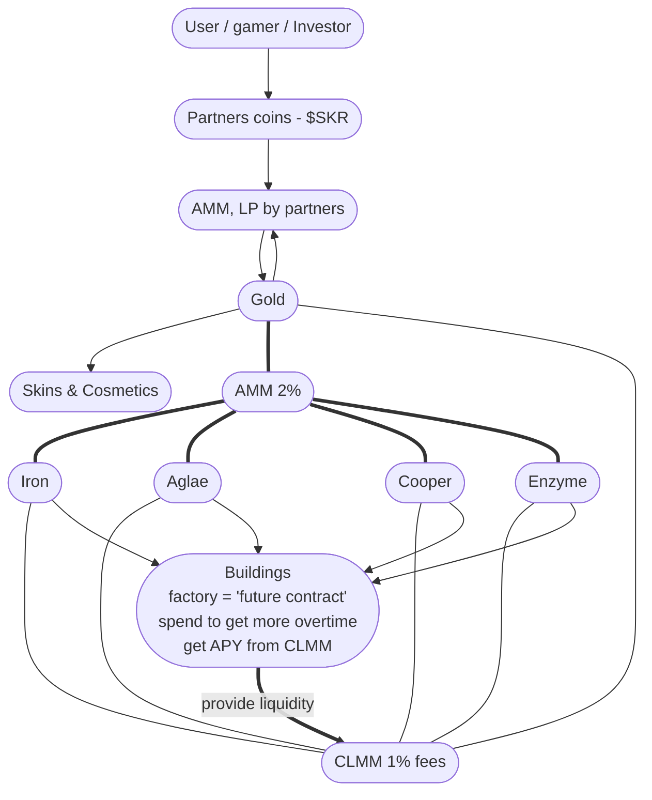

# Solrover

- Website: https://solrover.xyz/
- X / twitter: https://x.com/solroverxyz
- Direct contact: https://t.me/japardio
- Telegram chat: https://t.me/solroverxyz
- Telegram channel: http://t.me/solrover

Solrover is reverse survival game. You need to reach waypoint by driving rover, that always low on fuel, - the only way to get fuel is to deploy Crab-bots: collect resources and produce fuel for next mile. But of course they are not smart enough and you always have to help and fix them.

Manage bots, produce fuel and hide from the deadly sun by driving your rover!

---

# Gameplay

## Player mode

Player controls this character, it walks and can carry some resources. During daytime player need to hide from sun in rover. You have inventory and crafter to create new bots

## Rover mode

This is the rover, that player have to drive. It has limited fuel and storage, so player has to plan operations far ahead.

Driving rover is possible only when player is seated. Sun is not damaging rover or driver. Even if fuel runs out, player can hide there.

Player can carry items, and can look into inventory of each bot, rover or storage camps.

It’s very fun to ride and drift. _we can even make racing competition in the future_

## Control AI bots

Bots are programmed to search for exact resources and process them to produce useful materials. Player goal is to get sufficient amount of resources by using Crab-bots to establish new camps, produce fuel for rover and make new bots.

## Unity game

The game is build with unity, so supports a lot of platforms with high performance:

1. Web-browser (dApp)
2. Android (Seeker)
3. iOS, iPadOS
4. Mac, Windows, Linux
5. VR (meta quest)

# **Plot / Narrative**

There was one planet that are like Earth where science development went far with gene editing. They made new generation of humans with various mutations. During financial crisis they decided to blame mutants, and forced them to fly away to another planets. There was 4 planets as destination based on characteristics of mutants: Kepler 4b - planet with extreme sun, “water world”, gas giant and earth-like planets. They was living peacefully for thousand of years.

The first planet is very close to the sun, and day cycle is quick. Sun is very aggressive, destroys everything. Culture of this planet is very practical. Yet they are made up religion and cut connections with other planet, living in isolation. Effectively there is totalitarian regime. Priests lead everything, and lie about everything.

**Solrover** starts with destruction of the Capitol, with laser beam sent from origin planet. Reason is that they still in crisis and still using them as a “scapegoat”.

Main character was on mission on rover. He suddenly saw emergency notification and strange waypoint set on radar called “Archive Relay”.

Upon arrival game ends: Archive Relay is building for emergency situation that contains true concealed by Priests, and tech to reach other 3 planets to ask for help.

# Web3 Plans (no memecoin)

For NFTs: I would love to do simple “Founder Pass” or “Game Pass”, just to see if there are people that are willing to pay for the game. Yet there is nothing on that front.

Currently we do almost free cNFTs for in game collectables.

[Solrover](https://drip.haus/solroverxyz/store)

There are resources in game, as mentioned before. Crab-bots collect them, and you likely to have some after the game. It can and should be on-chain.

The core Web3 mechanic is that there will be one coin per resource type, making the economy fully on-chain. Using DEXes like Jupiter, we can combine AMM and CLMM pools. The AMM pool is governed by the Solrover team and collects 2% fees on all exchanges. Players can "build a factory" - committing some of their resources to earn yield from a CLMM pool at 1% fees. Because CLMMs are capital-efficient, players will likely accumulate a meaningful amount of tokens over time. This works because the CLMM fee is 1%, and as long as liquidity is present, this route performs better than a standard AMM. Additionally, since liquidity is concentrated, it is likely to hold price more effectively, making the economy exceptionally decentralised in a long run.

Players will receive resources in-game for free, or can exchange to acquire more. They can also earn resources in-game and exchange them back into other assets. Or provide liquidity as Factories, as explained above.

We plan to build the in-game economy on testnet using unpriced tokens, then later migrate to coins that have liquidity pools paired with USDT/SOL or with partner tokens. Or maybe even never do that.

---

I would love to connect: https://t.me/japardio

[solrover (@solroverxyz) on X](https://x.com/solroverxyz)
